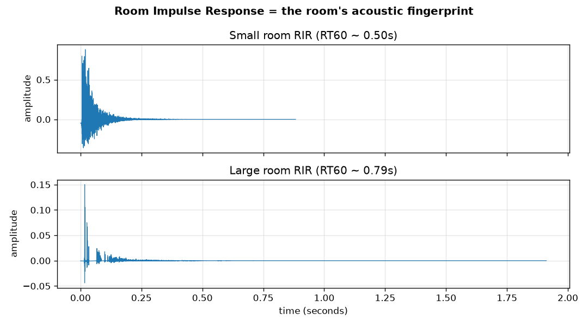
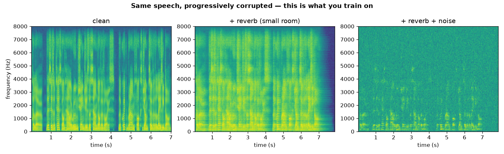
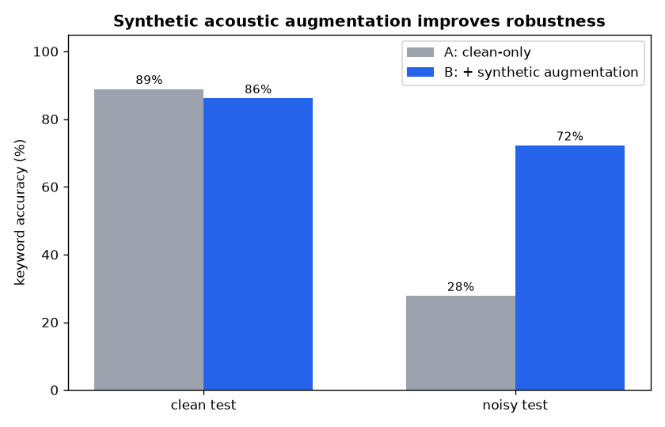

# Synthetic Acoustic Environments — a small learning demo

A hands-on exercise I built while reading into the audio side of the XPENG thesis topic,
to move from *reading* about acoustic data augmentation to actually seeing and hearing it.

It has two parts:

1. **`rir_demo.py`** — synthesise an acoustic environment: simulate a room, generate its
   impulse response, convolve clean speech with it, add noise at a target SNR.
   This is just the core equation made tangible:

   ```
   observed = clean_speech  *  RIR  +  noise
   ```

2. **`kws_augmentation_experiment.py`** — test whether that synthetic data is actually
   *useful*: train a small keyword spotter on clean speech vs. clean + synthetically
   augmented speech, and compare both in noisy, reverberant conditions.

Stack: `pyroomacoustics` (room simulation / RIRs), `librosa` (MFCC features),
`scikit-learn` (a deliberately simple downstream classifier).

---

## Part 1 — Synthesising the environment

Simulates the same clean utterance in a small room and a large room, then adds noise.

The two impulse responses — the large room's decay tail is visibly longer:



The same speech, progressively corrupted (clean → + reverb → + reverb + noise):



Running `python rir_demo.py` writes four audio files (`1_clean.wav` →
`4_noisy.wav`) so the progression can be listened to in order.

---

## Part 2 — Does the synthetic data actually help?

A four-word keyword spotter (`yes / no / stop / go`) — roughly the shape of a voice
assistant's wake-word front-end. Speech generated with macOS `say` voices, MFCC features
(20 coefficients, mean + std over time), SVM classifier.

Two models trained on the **same** clean data:

- **Model A** — clean speech only
- **Model B** — clean speech **+** synthetically augmented copies (random room RIRs,
  random SNR between 0–12 dB)

Both then evaluated on the **same** held-out noisy/reverberant test set.

| model | clean test | noisy test |
|---|---|---|
| A — clean only | 88.9% | **27.8%** |
| B — + synthetic augmentation | 86.1% | **72.2%** |



**+44 points of robustness** on the noisy set. The clean-only model collapses to roughly
chance (25% for four classes) — it doesn't just degrade, it stops working. The augmented
model also gives up ~3 points on clean audio, which is the expected robustness/accuracy
trade-off.

---

## Running it

```bash
python -m venv .venv && source .venv/bin/activate
pip install pyroomacoustics librosa scikit-learn numpy scipy matplotlib

# generate a clean speech clip (macOS)
say -o clean.aiff "Hello, this is a test of how a room changes the sound of a voice."
afconvert clean.aiff clean.wav -d LEI16@16000 -f WAVE

python rir_demo.py                      # synthesis: writes the audio files + plots
python kws_augmentation_experiment.py   # the experiment: prints the table, writes the chart
```

Built with the pyroomacoustics and librosa documentation and examples.
